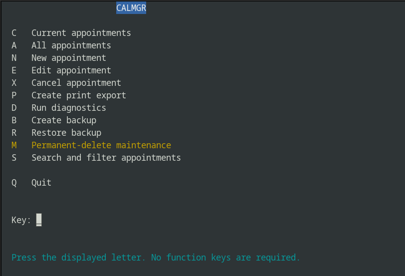
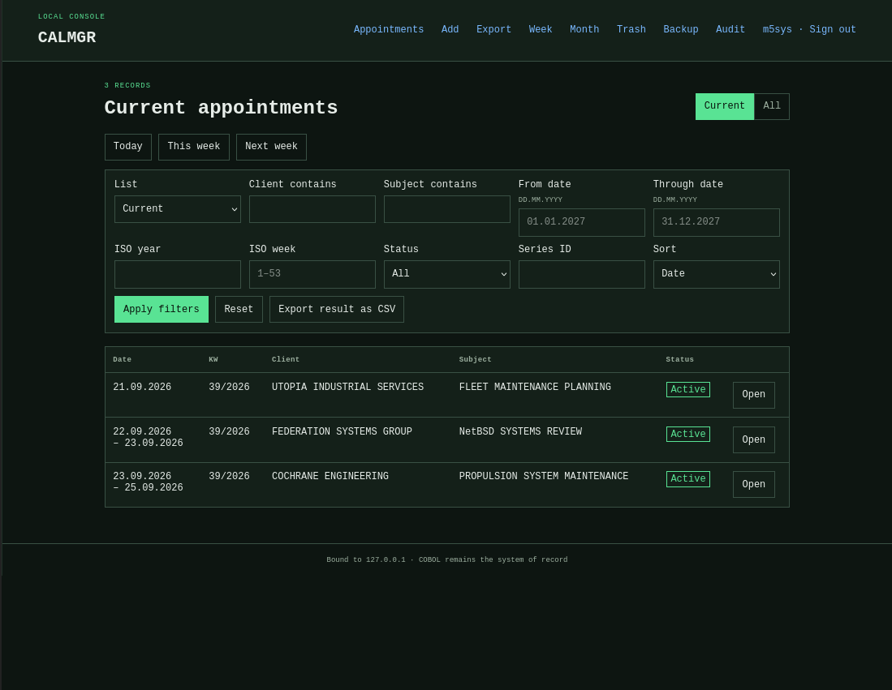
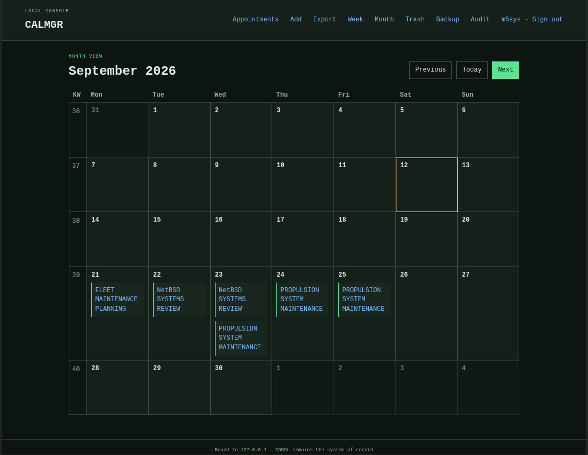

# CALMGR

**Calendar Management System**

Version 1.0.0

CALMGR is a calendar and appointment management system written primarily in GnuCOBOL.

It provides a terminal interface, a batch interface and a Flask based web interface. The application includes recurring appointments, calendar views, audit logging, backup and restore functions, CSV and iCalendar interchange, and fixed width print reports.

CALMGR is inspired by enterprise applications of the VAX/VMS and mainframe era.

## Screenshots

### Terminal interface

The terminal interface provides direct access to the main appointment,
reporting, backup and maintenance functions.



### Web interface

The optional Flask frontend uses the CALMGR batch interface and provides
access to the same appointment data from a browser.



### Month view

The month view provides a compact overview of appointments and recurring
entries.



## Why CALMGR?

CALMGR started out of curiosity and for hobbyist reasons. I wanted to build something substantial with GnuCOBOL, not just another small example program. I have also always enjoyed the character of traditional business software.

The project is inspired by enterprise applications of the VAX/VMS and mainframe era, with their terminal oriented interfaces, batch processing, conservative data handling and fixed width reports. It is not intended to reproduce any particular historical product or system.

There is also a practical reason for the reporting system. I like dot matrix printers. I wanted a calendar and appointment report that I could actually print on continuous paper and keep nearby as a physical overview of upcoming appointments. The fixed width layout, page headers and line printer style are therefore not just decoration. They are meant to be used.

CALMGR combines those ideas with a few deliberately modern choices. SQLite provides a simple and reliable persistence layer, while the Flask interface makes the same application convenient to use from a browser.

In short, CALMGR exists because I wanted to build a real application with GnuCOBOL, explore an older style of business computing that I enjoy, and end up with something I would actually use.

And yes, the interest in this kind of computing is quite real. There is a VAX 4000/200 running the latest release of NetBSD in my living room.

## Features

CALMGR currently provides:

* Appointment creation, editing and cancellation
* Multi day appointments
* Recurring appointment series
* ISO week based calendar handling
* Weekly calendar view
* Monthly calendar view
* Terminal user interface
* Flask based web interface
* Command line batch interface
* SQLite storage
* Audit logging
* Backup and restore
* Trash and appointment reactivation
* CSV import and export
* iCalendar export
* Fixed width print reports
* Calendar reports
* Streamlined appointment reports
* Print preview through the web interface
* CSRF protection for the web interface
* Password protected web access

## Interfaces

CALMGR has three main interfaces.

### Terminal interface

The terminal interface is the traditional interactive frontend.

```text
./calmgr
```

It provides access to appointments, calendar functions, reports and administrative operations without requiring a web browser.

### Batch interface

`calmgr-batch` provides a machine readable interface to the application.

```text
./calmgr-batch
```

The batch interface is also used by the web frontend. Keeping business operations behind the batch interface means that the Flask application does not implement a second, independent appointment system.

### Web interface

The web interface is implemented using Flask.

It provides:

* Appointment list and filtering
* Appointment details
* Appointment creation and editing
* Week view
* Month view
* Export functions
* Trash
* Backup and restore
* Audit log
* Print report generation

The visual design deliberately follows the character of traditional terminal and enterprise applications while remaining usable in a modern browser.

## Print reports

Print reports are an important part of CALMGR.

They use a fixed width layout and are intended to resemble traditional line printer and batch reports. They can also be printed on actual continuous paper using a dot matrix printer.

Two report layouts are available.

### Streamlined appointments

The streamlined report provides a compact chronological list.

```text
WK  DATE        RANGE          CLIENT            APPOINTMENT / SUBJECT
--------------------------------------------------------------------------------
38  14.09.2026  14.09.-16.09. EXAMPLE COMPANY   SYSTEM ADMINISTRATION
                                                 WORKSHOP AND DOCUMENTATION
```

Long subjects continue on following lines rather than being truncated.

### Calendar report

The calendar report is organized by ISO calendar week. Weeks without appointments remain visible, making the output useful as a year overview.

Appointments are printed below their corresponding calendar week.

Reports use fixed page lengths, report identifiers, run dates and page numbers. The final page contains an end of report marker.

This is intentional. The reports are designed to be useful as physical documents rather than merely imitate an old computer screen.

## Requirements

The core application requires:

* GnuCOBOL 3.2 or newer
* SQLite 3 runtime and development library
* libsodium with Argon2id support
* GNU Make
* A C11 compiler
* A POSIX compatible environment

The web interface additionally requires:

* Python 3.11 or newer
* Flask 3.x

On a Debian or Ubuntu based system the required packages can typically be installed with:

```sh
sudo apt install gnucobol libsqlite3-dev libsodium-dev make python3 python3-venv
```

## Building

Clone the repository:

```sh
git clone https://github.com/rodo6502/calmgr.git
cd calmgr
```

Build the application:

```sh
make all
```

This builds the main programs:

```text
calmgr
calmgr-batch
```

## Tests

Run the test suite with:

```sh
make test
```

Additional project checks can be run with:

```sh
make check
```

A complete local build and test cycle is:

```sh
make clean
make all
make test
make check
```

## Distribution archive

A release archive can be created with:

```sh
make dist
```

For version 1.0.0 this creates:

```text
calmgr-1.0.0.tar.gz
```

## Configuration

CALMGR reads its configuration from `calmgr.conf`.

Configuration includes paths for the database, audit log, backups and other runtime data.

The default configuration is:

```ini
DATABASE_FILE=data/appointments.db
BACKUP_FILE=data/appointments.backup.db
SAFETY_FILE=data/appointments.safety.db
WEB_HOST=127.0.0.1
WEB_PORT=5080
AUDIT_FILE=data/appointment-audit.log
PRINT_FILE=data/appointment-calendar.txt
LIST_PRINT_FILE=data/appointment-list.txt
CSV_FILE=data/appointments.csv
ICAL_FILE=data/appointments.ics
LOCK_FILE=data/appointments.lock
LINES_PER_PAGE=70
CANCEL_RETENTION_DAYS=90
```

The web frontend recognizes the following environment variables:

```text
CALMGR_CONFIG
CALMGR_BATCH
CALMGR_BATCH_TIMEOUT
CALMGR_WEB_SECRET
```

Compatibility fallbacks for older configuration names may still be present in version 1.0.0.

## First administrator

No default account or password is shipped. Bootstrap the first administrator exactly once, preferably via stdin:

```sh
./calmgr-batch - response.json <<'JSON'
{
  "command": "user-bootstrap",
  "username": "admin",
  "password": "REPLACE-WITH-A-STRONG-PASSWORD",
  "confirm": "CREATE-ADMIN"
}
JSON
```

Password bearing request files are confidential. The web transport sends requests over stdin and removes temporary response and upload files after use.

## Data storage

CALMGR uses SQLite for persistent storage.

SQLite is deliberately a modern part of the application. CALMGR does not try to reproduce a historically accurate VAX/VMS or mainframe software stack.

SQLite was chosen because it provides transactions, reliable local storage and a simple deployment model without requiring a separate database server.

The database is an implementation detail. The user facing behavior, batch oriented architecture and reporting conventions are where CALMGR takes most of its inspiration from traditional business systems.

## Backup and restore

CALMGR includes application level backup and restore functionality.

Backups should still be treated as part of a larger backup strategy if the application is used for important data.

Before restoring a database, make sure that no other CALMGR process is actively modifying it.

## Audit log

Changes to appointment data are recorded in the audit log.

The audit functionality is intended to make changes visible and traceable. It is not intended to provide the security guarantees of a dedicated tamper resistant audit system.

## Web setup

The Flask application is located in the `web` directory.

Create a Python virtual environment and install the web requirements:

```sh
python3 -m venv .venv
. .venv/bin/activate
pip install -r web/requirements.txt
```

Set an appropriate secret before using the web interface:

```sh
export CALMGR_WEB_SECRET='replace-this-with-a-random-secret'
```

The exact startup command and deployment method depend on whether the web interface is being used for development or as a persistent local service.

Do not expose the development server directly to an untrusted network.

## Project structure

The repository is organized roughly as follows:

```text
.
├── src/
│   ├── programs/
│   │   ├── calmgr.cob
│   │   └── calmgr-batch.cob
│   ├── services/
│   └── copybooks/
├── web/
│   ├── web_app.py
│   ├── templates/
│   └── static/
├── tests/
├── examples/
├── data/
├── imports/
├── calmgr.conf
├── Makefile
├── README.md
├── AUTHORS.md
└── LICENSE
```

The COBOL services contain the application logic and persistence related operations.

The batch program exposes those operations to other processes.

The Flask application uses the batch interface rather than maintaining an unrelated Python implementation of the same business logic.

## Design goals

CALMGR is intentionally conservative in a few areas.

Data should remain understandable and recoverable.

Reports should remain readable without special software.

The terminal interface should remain a first class interface.

Batch operation should remain possible.

The web interface should be convenient without becoming the application itself.

Modern components are welcome when they solve a practical problem. Historical accuracy is not a requirement.

## What CALMGR is not

CALMGR is not an emulator.

It is not a recreation of a particular VAX/VMS, IBM or other historical software product.

It does not attempt to reproduce a historically accurate operating environment.

It is also not intended to compete with modern hosted scheduling platforms.

It is a hobby project and a practical calendar application built around GnuCOBOL and influenced by an older style of business computing.

## Version

The current public version is:

```text
CALMGR 1.0.0
```

Version 1.0.0 is the first public release under the CALMGR name.

Internal database format versions are independent of the public CALMGR release number and may therefore have different version numbers.

## Author

Robert Dörfler

GitHub: https://github.com/rodo6502/

## License

CALMGR is released under the MIT License.

Copyright (c) 2026 Robert Dörfler

See `LICENSE` for the complete license text.
